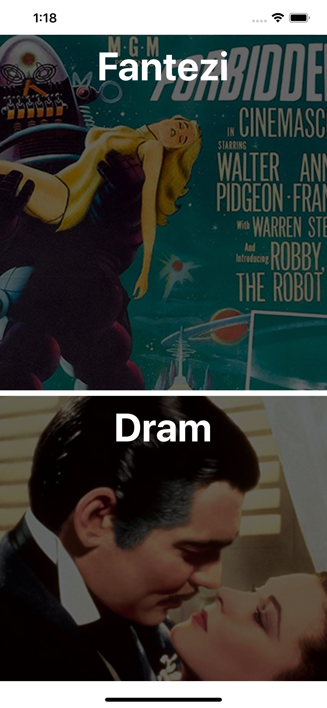

<p align="center">
  
  <h1 align="center">ParallaxList</h1>
  <h2 align="center">Made with React Native</h2>
</p>


## In-App

<p>


</p>

---

## Table of Contents

- [Description](#description)
- [Prerequisites](#prerequisites)
- [Clone and Running](#clone-and-running)
- [Components Used](#components-used)
- [References](#references)
- [License](#license)

---

## Description

Kodluyoruz iş başvurusunun ödev projesidir. Tamamen React Native ve React Native Animated API kullanılarak yapılmıştır. Herhangi bir üçüncü parti paket kullanılmamıştır.

---

## Prerequisites

React-Native 0.63 sürümü proje için yeterlidir. Ekstra bir pakete ihtiyaç duyulmamaktadır.

---

## Clone and Running

```shell
git clone git@github.com:erdemozk/ParallaxList.git
cd ParallaxList
npm install
react-native run-android or react-native run-ios
```

---

## Components Used

- [x] [React]
- [x] [SafeAreaView]
- [x] [ParallaxList]
- [x] [View]
- [x] [Animated.Text]
- [x] [Animated.ScrollView]
- [x] [ImageBackground]

---

## `ParallaxList` Component

It is the main component of the application.

```js
import ParallaxList from './src/views/ParallaxList';
```

### Properties

It can be used with any JSON file that meets the JSON requirements follows:

| Prop        | Description                                       | Default     | Type     | Required   |
| ----------- | ------------------------------------------------- | ----------- | -------- | ---------- |
| **`data`**  | Data to will provide text and picture on cards    | _None_      | JSON     | YES        |

#### JSON Requirements

| Key          | Description                                             | Value Type      | Required     |
| ------------ | ------------------------------------------------------- | --------------- | ------------ |
| **`id`**     | Unique ID in the View Component of the card             | String          | YES          |
| **`genre`**  | Text in the Text Component of the card                  | String          | YES          |
| **`image`**  | Image in the ImageBackground Component of the card      | URL or PATH     | YES          |

## References

- [React Native Docs](https://facebook.github.io/react-native/docs/getting-started.html)
- [React Native Animated API](https://reactnative.dev/docs/animated)
- [Stack Overflow](https://stackoverflow.com/)
- [Youtube](https://www.youtube.com/)

---

## License

[](http://badges.mit-license.org)

- **[MIT license](http://opensource.org/licenses/mit-license.php)**